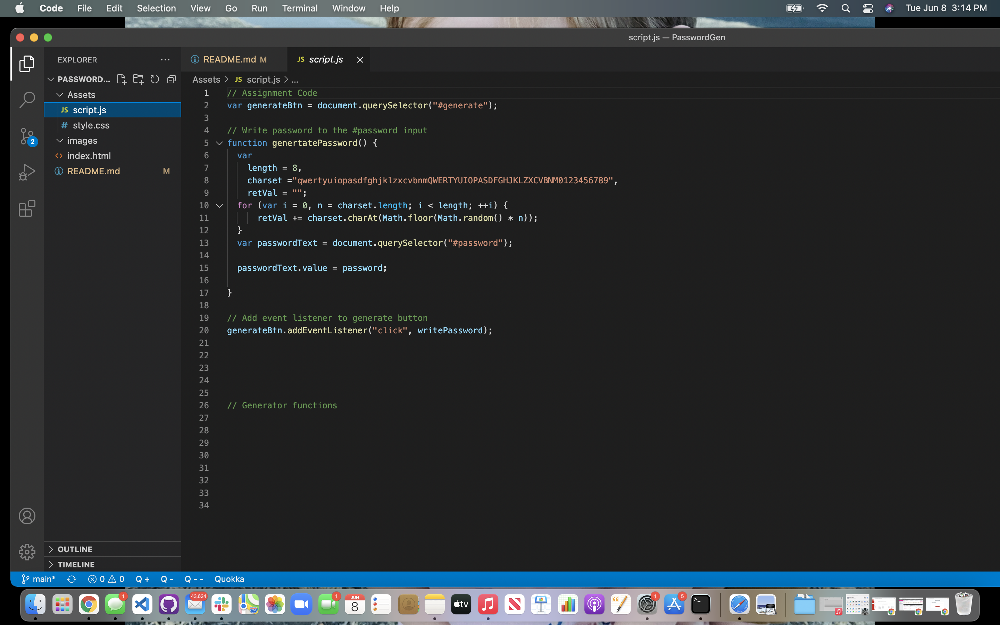

# Password Generator
Kiessa Legacie 3:05 pm
# Challenge 3 - JavaScript Password Generator 
> GENERATE RANDOM PASSWORD
---
### Table of Contents
- [Description](#description)
- [Introduction](#introduction)
- [Challenges](#challenges)
- [Victories](#victories)
- [Resources](#resources)

---

## Description

Challenge #3 - Password Generator

## Introduction 
This week we were introduced to JavaScrip and learning how to create generated responses.

--
Kiessa Legacie - 3:11 PM
## Challenges
I struggled quite a bit with the new material. I think the more I practice the more comfortable I will become.
---
## Victories
PUTTING THE WHOLE THING TOGETHER!

---
Starting to write with the given code.

---

The design aspect is proabably my favorite part of the process. I found another really cool resource for adding icons! I decided to utilize that also! 

## Resources 

<a href="#">GitHub Repo</a>

<a href="https://www.youtube.com/watch?v=eVGEea7adDM"> YouTube</a>

<a href="https://www.google.com/webhp?hl=en&sa=X&ved=0ahUKEwiLjJ7fosLvAhWXW80KHawRD_oQPAgI">Google</a>

<a href="https://www.w3schools.com/charsets/ref_html_ascii.asp">w3 Schools</a>

